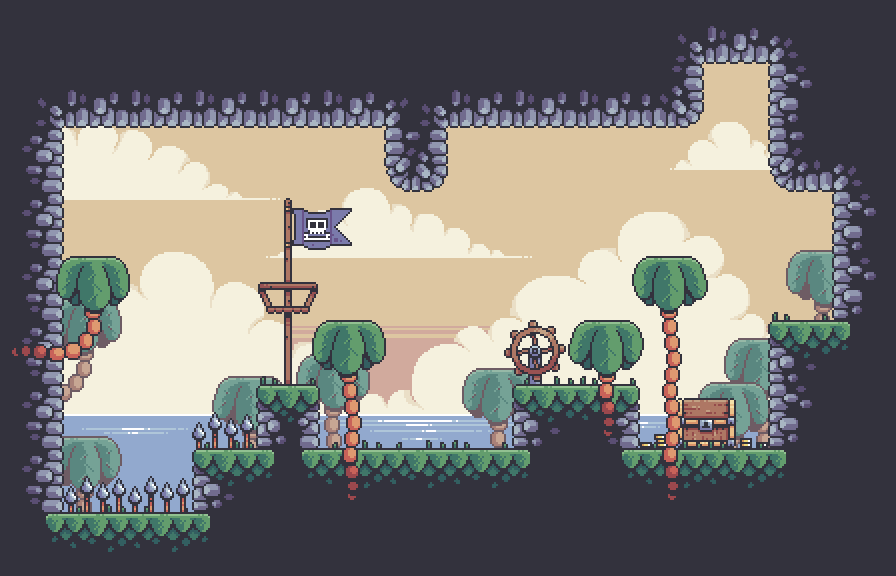

# THE TREASURE HUNT
#### _Object-Oriented Programming Project_


#

## Introduction
In today’s rapid evolution of technology industry, there is an increasing need for continuous learning and updating of knowledge. To facilitate the adoption of new ideas, Object-Oriented Programming has emerged as a robust paradigm for organizing projects that including code more reusability, modularity, maintainability, and scalability, to embrace new algorithms more easily and systematically.

Consequently, our team has made the choice to utilize Java.Swing (Java.awt) as the primary library for coding and implementing Object-Oriented Programming (OOP) in our game project, _“The Treasure Hunt”_. This decision was made in order to evaluate the viability of the principles inherent in this model. Furthermore, our goals encompassed enhancing our proficiency in collaborative projects and obtaining a more comprehensive comprehension of the game development process.

### Team members:

| Order | Full name | ID |
| ------ | ------ | ------ |
| 1 | [Tran Ngoc Dang Khoi](https://github.com/koitran14) | ITCSIU21197 |
| 2 | [Nguyen Tran Hoang Ha](https://github.com/HoangHaITITIU21127) | ITITIU21127 | 
| 3 | [Ha Van Uyen Nhi](https://github.com/Jay2717) | ITCSIU21095 |
| 4 | [Nguyen Hoang Quan](https://github.com/Quanchip) | ITITIU21291 |


### After this project, we aim to gain:
- Deep learning of Object-Oriented Programming's Principles✨
- Process of game development and some tricks✨
- Teamwork skills✨

## About the game
_"The Treasure Hunt"_ is a platform game where players control a pirate character, _Captain Jack_, navigating through levels filled with challenges and enemies. The game features a two-dimensional side-scrolling environment where players must jump over gaps, dodge hazards, and defeat aggressive enemies with swords. Cannons and traps add additional obstacles throughout the game. The levels progressively increase in difficulty, providing an engaging and challenging experience. The unique pirate theme and the presence of crabs as enemies add a distinctive flavor to the game, aiming to provide players with a fun and immersive experience.

## Technique 
To do this project, we use: 
- Language: `Java`
- Library: `Java.awt`
- IDE: `IntelliJ`, `VsCode`, `Esclipe`.

## Methodology

To do this game, we create 10 packages to operate 10 main features of the game:
1. Main package
2. Levels package
3. Entities package
4. Objects package
5. Gamestates package
6. Inputs package
7. UI package
8. Audio package
9. Effects package
10. Utilz package

For more detailed information, you can find out in this [file](https://github.com/koitran14/The-Treasure-Hunt-Project/blob/main/The%20Treasure%20Hunt%20report.pdf).

## User manual
### ✨ Menu Navigation: 
- Use the mouse click to select options in the game's menu. 
- Press _`Ecs`_ to pause the game.


### ✨ About character:
- Stats of character: _`200HP`_ and _`200PP`_ maximum, **automatic PP-recovery only**.
- Movement: _`A`_, _`D`_ and _`SPACEBAR`_ to move _left_, _right_ and _jump_ on the grid.
- Attack: Use _`right-click`_ to attack, _`left-click`_ for the faster.
> Note: `the quick attack` is required a huge energy consumption,
<br>and you could use it with _`SPACEBAR`_ to surf in the air.


### ✨ Items:
- Potions: to recover stats of character with _`RED_POTION`_ for HP and _`BLUE_POTION`_ for PP.
- Container: to contain the potions.

# Installation
Once the download is complete from github, you can launch the game in two ways:
### ✨ By Common Prompt (CMD):
- Step 1: Open the _`src`_ file.
- Step 2: _`Right-click`_ once, then select _`Open in Terminal`_.
- Step 3: Type like below and enjoy.


```sh
...\OOP.Project\src> javac *.java
...\OOP.Project\src> java MainClass
```
### ✨ By Editor (VsCode, IntelliJ, Esclipe):
Just open this project in your IDE, then enjoy 😉


## Result
To summarize, the development of the Treasure Hunt game was made easier and more logical by adopting the Object-Oriented Programming (OOP) approach. This project effectively exemplifies the fundamental principles of OOP, such as encapsulation, abstraction, inheritance, and polymorphism. Alongside gaining expertise in applying OOP principles, it is essential to expand knowledge in related areas beyond the course curriculum. These areas encompass utilizing GIT for version control, resolving software bugs, solving complex problems, programming interactive games, and improving collaboration skills.

## Limitation
Furthermore, the game possesses several constraints. To be specific, the game remains unfinished due to time constraints and a lack of sufficient experience and expertise. Consequently, the classes and methods lack proper organization, efficiency, and cleanliness, making testing a rather complex task. Most importantly, the team encountered challenges in constructing, coordinating, and assigning tasks, occasionally necessitating starting over due to inexperience and confusion in the game development process.
## References

### Tutorials and Resources
- [Treasure Hunter - Pixel Frog](https://pixelfrog-assets.itch.io/treasure-hunters): The main source of inspirational concept and animations for this project, including main character, weapons, enemies and environmental elements,...
- [Java Game Development Tutorial - Kaarin Gaming](https://youtu.be/6_N8QZ47toY): A playlist of video tutorials covering various aspects of the project.

### External Libraries and Frameworks
- [Java AWT](https://www.geeksforgeeks.org/what-is-java-awt-graphics/): A powerful library used in this project for Graphics. 


### Acknowledgements
- [Dr. Le Duy Tan](https://it.hcmiu.edu.vn/user/ldtan/): Made significant contributions, particularly in Object-Oriented Programming's standard knowledge, which supported for the whole concept of project.
- [Dr. Kieu Vu Thanh Tung](https://it.hcmiu.edu.vn/user/kvttung/): Provided valuable feedback and suggestions throughout the project's development.

### Documentation
- To know more about our project, read [me](https://github.com/koitran14/The-Treasure-Hunt-Project/blob/main/The%20Treasure%20Hunt%20report.pdf).


**Thanks for reading, please enjoy 💖**
